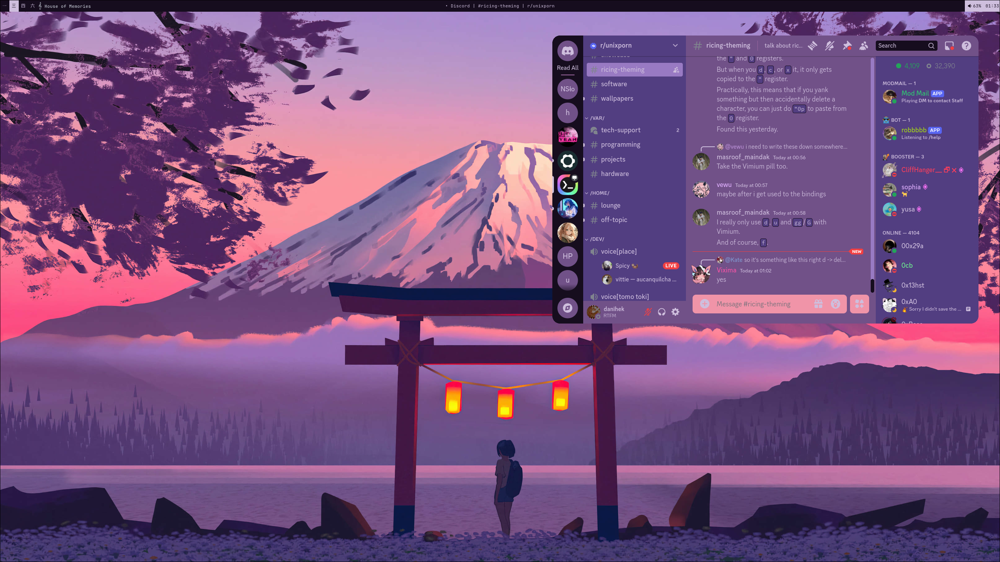
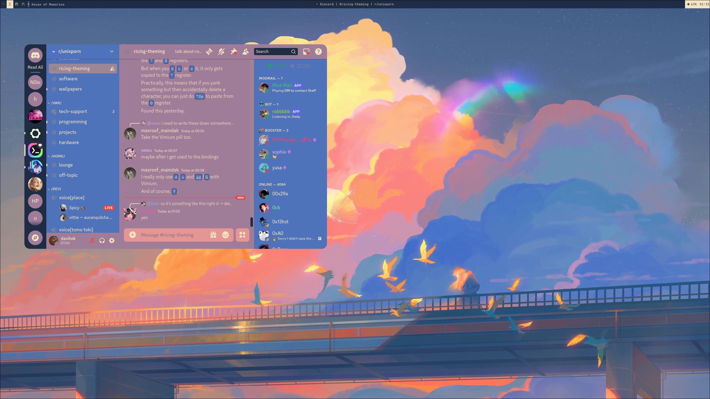
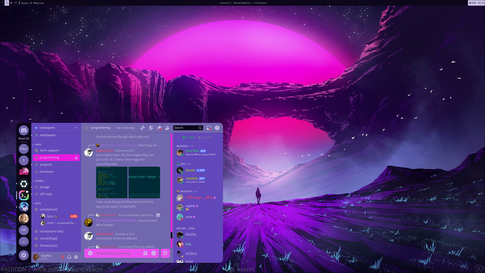
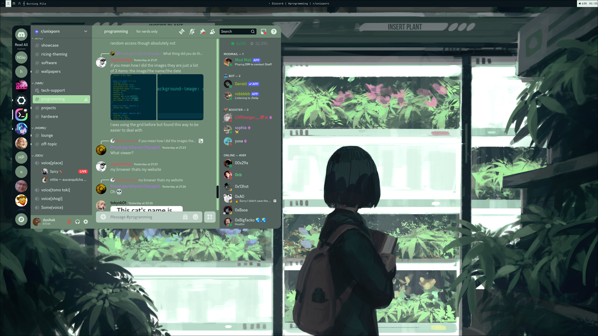

# Themecord
Discord theme that will always match your wallpaper!


## Why?
Because why not, I like having same theme on everything I thought it's cool.

## What does it really change?
Like in title, overall discord theme, but Themecord also contains little animations on cursor hover on specific objects, list etc.

## Dependecies
- Compatible discord client
- One of color palettes generators:
    - [hellwal](https://github.com/danihek/hellwal)
    - [python-pywal](https://github.com/dylanaraps/pywal)
    - [wallust](https://codeberg.org/onemoresuza/wallust)

## Supported Clients:
- Vencord
- Vesktop

## Generating colorscheme
Before you even start doing **ANYTHING**, you have to choose if you wanna use pywal or wallust

### In case of hellwal you have to copy css file:
``./css/hellwal/discord-colors.css`` to ``~/.config/hellwal/templates/`` folder

### in case of pywal:
``./css/pywal/discord-colors.css`` to ``~/.config/wal/templates/`` folder

### and in case of wallust:
``./css/wallust/discord-colors.css`` to ``~/.config/wallust/templates/`` folder

also add to ``~/.config/wallust/wallust.toml`` required config:

```
[templates]
themecord.template = "discord-colors.css"
themecord.target = '~/.cache/wallust/discord-colors.css'
```

## Installation (Manual)

1. Install supported discord client
2. Download themecord from [release](https://github.com/danihek/Themecord/releases) page
3. Look into **# Generating colorscheme** Section
4. In your discord client, go to themes and select Themecord from available themes.
5. Now after you run hellwal, pywal or wallust  run ``./themecord`` and your discord theme will be applied.

You can put it in ``/usr/local/bin/`` for ease of use

## Installation (NixOS)
1. Add themecord to inputs(just like home-manager) in your config flake:
```
themecord = {
   url = "github:danihek/themecord";
   inputs.nixpkgs.follows = "nixpkgs";
 };
```

2. Add as a module:
```
({ config, pkgs, ... }: {
  environment.systemPackages = with pkgs; [
  themecord.packages.x86_64-linux.default
  ];
})
```
(Example from my config)

 
3. Rebuild your configuration and run ``themecord``

4. Go to discord client and select Themecord from available themes
   

5. Now after you run hellwal, pywal or wallust  run ``./themecord`` and your discord theme will be applied.
and your discord client will update it's theme.

## Nix
In folder ``./nix`` you can see example how I added to my flake hellwal, wallust and pywal templates.

## Example usage
In folder ``./example`` you see example script which you can use as your template in your own script/config for changing wallpapers and edit to your needs.

# Enjoy theme'in!!

## Showcase







